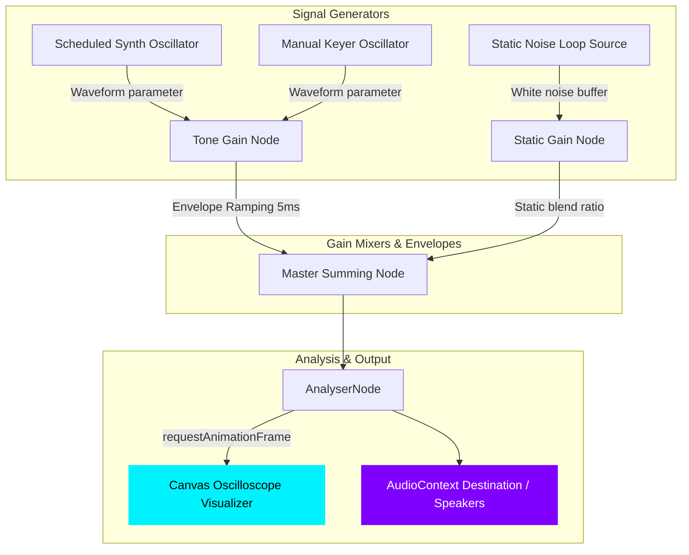

# Aether Morse 🌌📡
### *Interstellar Sound, Synthesis & Telegraph Practice Station*

Aether Morse is an ultra-premium, interactive single-page web portal designed for translating, synthesizing, visualizing, and learning Morse Code in real-time. Built entirely with clean **Vanilla HTML5, CSS Variables, and the Web Audio API**, the application features a frosted glass celestial dark theme, adjustable tone synthesizers, a live time-domain canvas oscilloscope, atmospheric static mixers, and a gamified practicing card tutor that checks your manual keyer timing in real-time.

---

## 📸 Dashboard Preview

Here is a high-resolution look at the finished premium Aether Morse console:


---

## 🌟 Core Features

### 1. 🛰️ Bidirectional Translation Hub
- **Instant Translation**: Type standard English in the Plain Text area to dynamically render dots (`.`), dashes (`-`), character spaces (` `), and word boundaries (`/`). Or type Morse symbols directly to translate back instantly.
- **Dynamic Indicators**: Real-time counter metrics list symbol and character sizes, and dynamic indicators shift color based on which panel is actively typing.

### 2. 🔊 The Auralizer Synthesizer
- **Low-pop Audio Windowing**: Rather than playing static audio clips, Aether Morse initiates low-level `OscillatorNode` and `GainNode` audio contexts. It applies a $5\text{ms}$ linear ramp rise/fall envelope (envelope windowing) to completely eliminate high-frequency speaker clicking/popping at tone boundaries.
- **Waveform Modulators**: Toggle between four custom audio settings:
  - **SINE** (clean radio signal)
  - **TRIANGLE** (warm vintage tone)
  - **SQUARE** (retro arcade voice)
  - **SAWTOOTH** (military buzzer)
- **Atmospheric Static Simulator**: Mixes simulated interstellar background white noise fuzz ($0\%$ to $100\%$) generated by a looping procedural noise buffer on-the-fly.

### 3. 📈 Cybernetic Time-Domain Oscilloscope
- Employs an `AnalyserNode` connected inside the compound audio graph.
- Renders glowing neon cyan wave visuals dynamically on a `<canvas>` element using high-frequency `requestAnimationFrame` ticks. The visualizer line expands and dances dynamically in rhythm with synthesized playback, custom keyer taps, or background static noise.

### 4. 🎓 Transmission Training Tutor
- **3D Telegraph Keyer**: Key in Morse code manually using your mouse/touchscreen or the keyboard **Spacebar**.
- **Timing threshold detection**: Measures timing duration ($t_{\text{up}} - t_{\text{down}}$) against standard WPM-dot thresholds to accurately distinguish dots from dashes.
- **Gamified Word Challenges**: Click **Start Practice** to start target challenges. The app pulls random celestial target words (e.g. `STAR`, `SIGNAL`, `GALAXY`), guides your keystrokes with target Morse codes, and evaluates taps in real-time. Successful inputs glow **neon green**, errors shake **red**, and progress bars fill up sequentially.

---

## ⚙️ Technical Architecture & Signal Path

Aether Morse's high-performance, zero-latency pipeline routes compound audio streams through a visual analysis filter before reaching the speakers:



### Manual Keyer Timing Spacers
The manual parser distinguishes inputs by analyzing idle gaps between consecutive keystrokes:
* **Dot vs. Dash**: Keystrokes less than $1.5 \times t_{\text{dot}}$ are registered as dots. Anything longer is classified as a dash.
* **Character Spacer**: If inactivity lasts longer than $3.5 \times t_{\text{dot}}$, the active live buffer is flushed and translated into a completed plain character.
* **Word Spacer**: If inactivity lasts longer than $7.5 \times t_{\text{dot}}$, a standard word break (` / `) is appended.

---

## 🛠️ How to Launch Locally

Since the application is built entirely as a static frontend bundle, running it locally requires no build steps or heavy dependencies:

1. **Clone the repository**:
   ```bash
   git clone https://github.com/YOUR_GITHUB/aether-morse.git
   cd aether-morse
   ```

2. **Start a local lightweight server**:
   * **Python 3**:
     ```bash
     python3 -m http.server 8182
     ```
   * **Node.js (http-server)**:
     ```bash
     npx http-server -p 8182
     ```

3. **Open the browser**:
   Navigate to **`http://localhost:8182`** and begin transmitting!

---

## ⌨️ Desktop Spacebar Shortcut
- Tap the **Spacebar** anywhere on the viewport to tap the manual telegraph keyer.
- To prevent keyboard collision issues, the Spacebar listener automatically deactivates when focusing plain/Morse textareas or selection fields, preserving your standard typing.

---

## 🌌 Designed with Cosmic Pride
Designed with deep-space HSL color systems, frost glass overlays, and low-latency audio logic by Antigravity AI. 🛰️🚀
