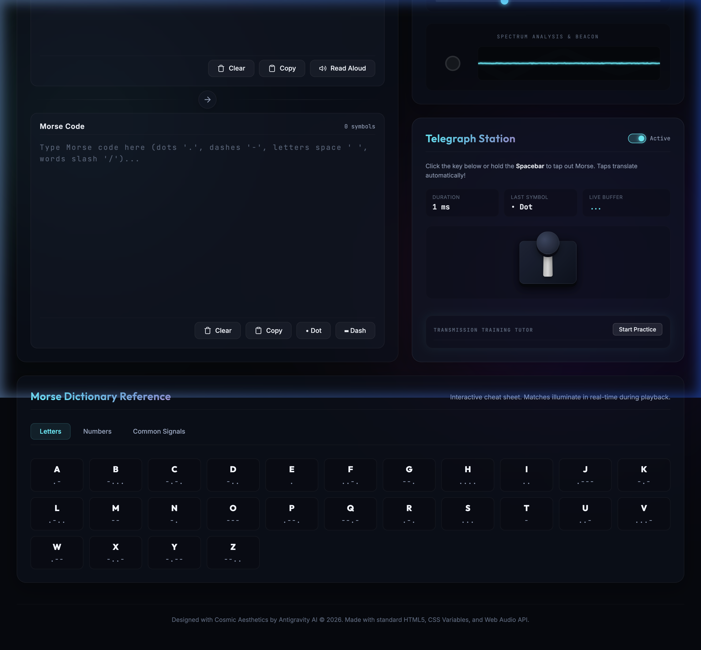
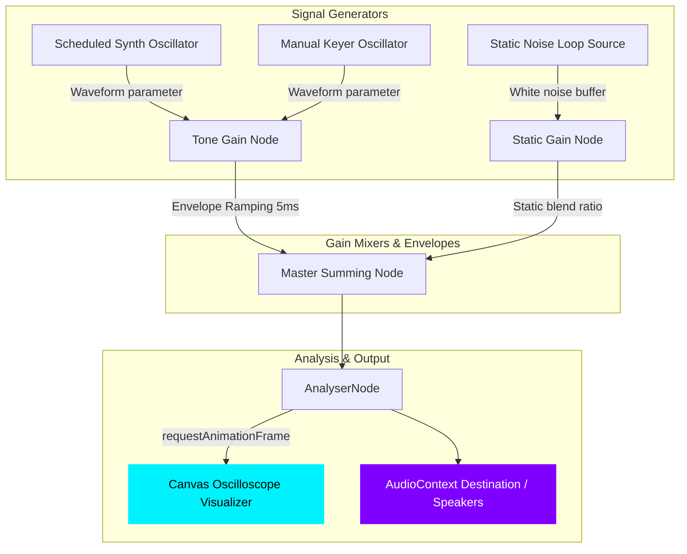

# 🌌 Aether Morse


### 🚀 **[Live Demo: aethermorse.netlify.app](https://aethermorse.netlify.app/)**

**Aether Morse** is an ultra-premium, interactive single-page web portal designed for translating, synthesizing, visualizing, and mastering Morse Code in real-time. Built from the ground up with clean **Vanilla HTML5, CSS Variables, and the Web Audio API**, the application features a frosted glass celestial dark theme, real-time sweeping audio synthesizers, a live time-domain canvas oscilloscope, atmospheric static mixers, and a gamified practicing tutor.

---

## 📸 Dashboard Preview

Here is a high-resolution look at the finished premium Aether Morse console:



---

## ✨ Core Features

### 🛰️ Bidirectional Translation Hub
- **Instant Translation**: Type standard English in the Plain Text area to dynamically render dots (`.`), dashes (`-`), character spaces (` `), and word boundaries (`/`). Alternatively, type Morse symbols directly to decode back to plain text instantly.
- **Dynamic Indicators**: Real-time counter metrics list symbol and character counts, and dynamic status indicators shift color based on the active typing panel.

### 🔊 The Auralizer Synthesizer
- **Low-Pop Audio Windowing**: Rather than relying on static audio clips, Aether Morse initiates low-level `OscillatorNode` and `GainNode` audio contexts. It applies a precise 5ms linear ramp rise/fall envelope (windowing) to completely eliminate high-frequency speaker clicking/popping at tone boundaries.
- **Real-Time Parameter Sweeps**: **[NEW]** Instantly adjust the **Speed (WPM)**, **Tone Pitch (Hz)**, and **Waveform** mid-transmission. Aether Morse tracks active playing oscillator nodes and instantly applies parameter changes on-the-fly, allowing for beautiful, sweeping sci-fi synthesizer effects.
- **Waveform Modulators**: Toggle between four custom audio settings in real-time:
  - **SINE** (clean radio signal)
  - **TRIANGLE** (warm vintage tone)
  - **SQUARE** (retro arcade voice)
  - **SAWTOOTH** (military buzzer)
- **Atmospheric Static Simulator**: Mixes simulated interstellar background white noise fuzz (0% to 100%) generated by a looping procedural noise buffer on the fly.
- **Integrated Hear Code Trigger**: Playback transmissions directly from the Morse Code translation card with synchronized UI state management and absolute sound cancellation.

### 📈 Cybernetic Time-Domain Oscilloscope
- Employs an `AnalyserNode` integrated seamlessly into the compound audio graph.
- Renders glowing neon cyan wave visuals dynamically on a `<canvas>` element using high-frequency `requestAnimationFrame` loops. The visualizer line expands and dances rhythmically with synthesized playback, custom keyer taps, or background static noise.

### 🎓 Transmission Training Tutor
- **3D Telegraph Keyer**: Key in Morse code manually using your mouse, touchscreen, or designated keyboard bindings.
- **Precision Keyboard Hooks**: **[NEW]** Added direct keyboard overrides for timing-free tapping. Use the `.` (Period) key for an instant perfect *dit* and the `-` (Minus) key for a perfect *dah*, completely bypassing spatial timing issues while practicing.
- **Timing Threshold Detection**: For traditional Spacebar keying, the engine measures timing duration ($t_{up} - t_{down}$) against standard WPM-dot thresholds to accurately distinguish dots from dashes in real-time.
- **Gamified Word Challenges**: Click **Start Practice** to initiate targeted challenges. The app pulls random celestial target words (e.g. `STAR`, `SIGNAL`, `GALAXY`), guides your keystrokes with target Morse codes, and evaluates inputs in real-time. Successful inputs glow **neon green**, errors shake **red**, and progress bars track completion.

---

## ⚙️ Technical Architecture & Signal Path

Aether Morse's high-performance, zero-latency pipeline routes compound audio streams through a master visual analysis filter before reaching the final destination:



---

## 🛠️ Installation & Local Development

Aether Morse is built entirely as a static frontend bundle. Running it locally requires zero build steps or heavy dependencies:

1. **Clone the repository**:
   ```bash
   git clone https://github.com/shard-c6/aether-morse.git
   cd aether-morse
   ```

2. **Start a local lightweight server**:
   Using Python 3:
   ```bash
   python3 -m http.server 8182
   ```
   Or using Node.js (`http-server`):
   ```bash
   npx http-server -p 8182
   ```

3. **Launch**:
   Navigate to **`http://localhost:8182`** in any modern web browser.

---

## 🚀 Deployment

This project is fully configured for continuous deployment on **Netlify**.
- The `netlify.toml` file declares production-grade HTTP security headers including strict Content-Security-Policy, X-Frame-Options, and X-Content-Type-Options.
- Simply link your GitHub repository to Netlify and it will automatically deploy the `main` branch.

---

## ⌨️ Global Keyboard Shortcuts

| Action | Key Binding | Description |
|--------|-------------|-------------|
| **Manual Keyer (Tap)** | `Spacebar` | Hold and release to manually tap Morse based on WPM thresholds. |
| **Instant Dit (Dot)** | `.` (Period) | Automatically triggers a perfect dot tone and appends to buffer. |
| **Instant Dah (Dash)** | `-` (Minus) | Automatically triggers a perfect dash tone and appends to buffer. |

*(Note: Shortcuts dynamically disable when actively typing in plain text or morse code input fields to preserve native typing behavior.)*

---

## 🌌 Cosmic Design & Engineering

Architected with deep-space HSL color systems, frost glass overlays, and low-latency audio logic. Designed to deliver an unparalleled interactive audio-visual experience without the bloat of modern JS frameworks. Produced with pride. 🛰️🚀
